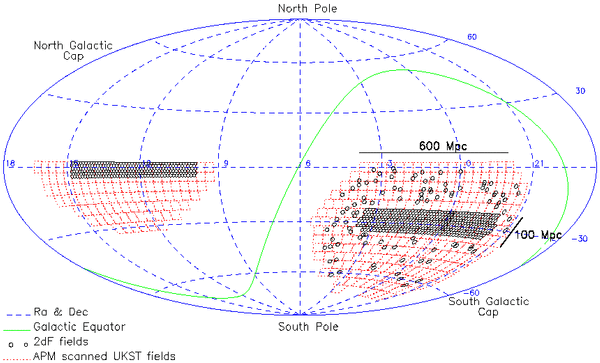
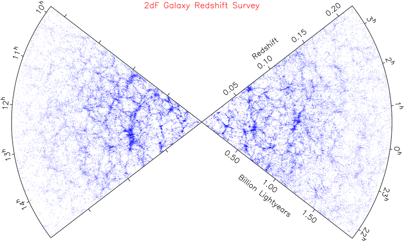
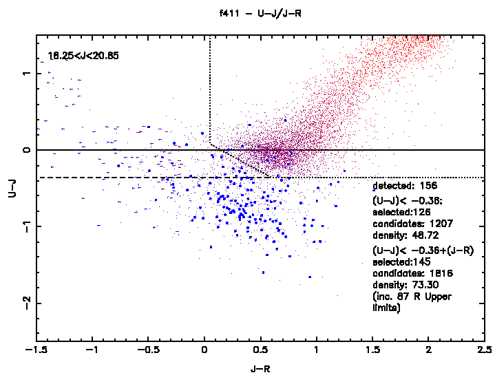
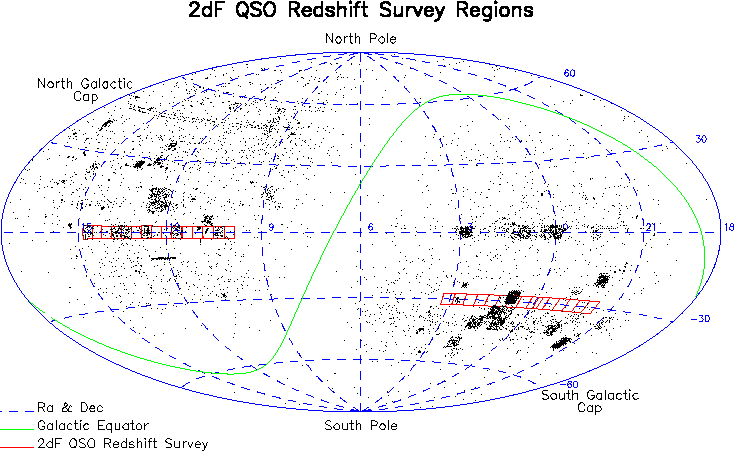
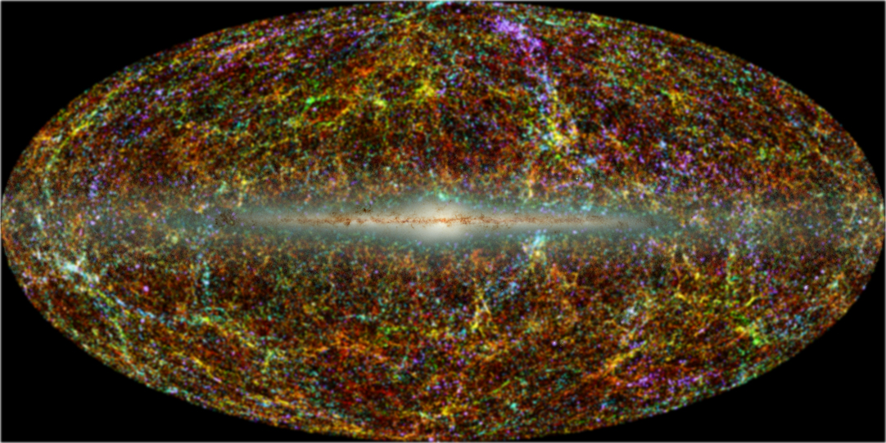

<!--Compiled by RStudio.-->

# This is a list of experiments that can be used to probe gravity properties or the properties of the universe.

## General Relativity/Gravitation

### Eotvos Torsion Balance

Detection of $R^k_{0l0}=(1/c^2)\partial^2\Phi/\partial x^k\partial x^l \sim 10^{-32} \text{cm}^{-2}$.

### Hughes-Drevershiy Experiment, etc

Anisotropy of gravitation/electromagnetism is not proved in our galaxy.

## Receding or Exapnding

### Galaxy Distribution

#### Redshift Survey/Galaxy Survey

##### CfA Redshift Survey, the first redshift survey,www.cfa.harvard.edu

##### 2dF Galaxy Redshift, [Wikipedia](http://en.wikipedia.org/wiki/2dF_Galaxy_Redshift_Survey), [offical site](http://www2.aao.gov.au/2dFGRS)

**2dFGRS**, spectroscopic survey, is integrated with the 2dF QSO survey.

* Objects:245591, mainly galaxies, brighter than a nominal extinction-corrected magnitude limit of $b_J = 19.45$. Reliable (quality>=3) redshifts were obtained for 221414 galaxies.

* Area, 1500 square degrees. A figure from official site is shown below.

* Galaxy distribution results from completed survey:

**2dF QSO Redshift Survey**, 2QZ. Already integrated into 2dFGRS.

* Objects: Magnitude limits are $18.25<b_J<20.85$. Color selection is $u-b_J$ vs. $b_J-r$ plane.

* Area:

**6dF QSO Redshift Survey**

* Objects: limits $16.0<b_J<18.25$.

##### 2 MASS Redshift Survey

**2MASS**, the [Two Micron All Sky Survey](http://www.ipac.caltech.edu/2mass), "is designed to close the gap between our current technical capability and our knowledge of the near-infared sky. In addition to providing a contex for the interpretation of results obtained at infrared and other wavelengths." It shows the large-scale structure of the Milky Way and the Local universe.

* Objects: Limited. to local universe.
* Area: All sky scanning
* Band: 3 near-infared bands.
* Reslution: pixel size 2.0".RNR>10.

**2MRS**, the 2MASS Redshif Survey, aims to map the distribution of galaxies and dark matter in the local universe, based on galaxy selectian of 2MASS.

* Objects: Aim to 45000 galaxies up to K=11.75mag. This is completed.
* Redshift out to $z=0.03$ (mean value), or equivalently to 115Mpc/370 million light-years.
* Band: near infra-red J,H and K-band.

* All sky map of local universe in infared

##### VLA FIRST Survey

**VLA FIRST Survey**, Faint Images of the Radio Sky at Twenty-cm using NRAO Vary Large Array..

> Aim in one sentence:
> 'designed to produce the radio equivalent of the Palomar Observatory Sky Survey over 10,000 square degrees of the North and South Galactic Caps.

* Objects
* Area: 

##### Sloan Digital Sky Survey

##### Galaxy And Mass Assembly Survey

##### DEEP2 Redshift Survey, high redshift

##### VIMOS-VLT Deep Survey, high redshift

#### Redshift Obervation

